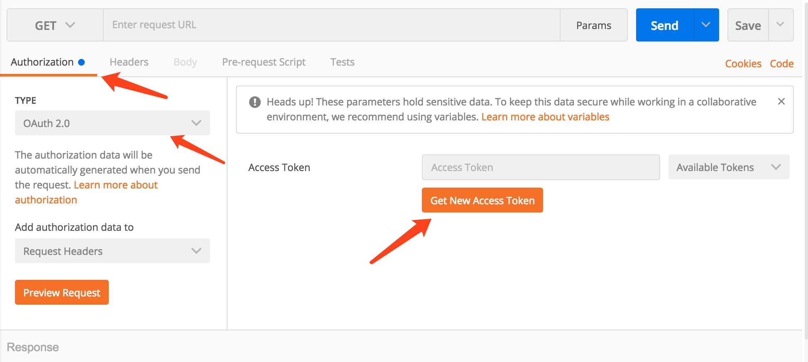
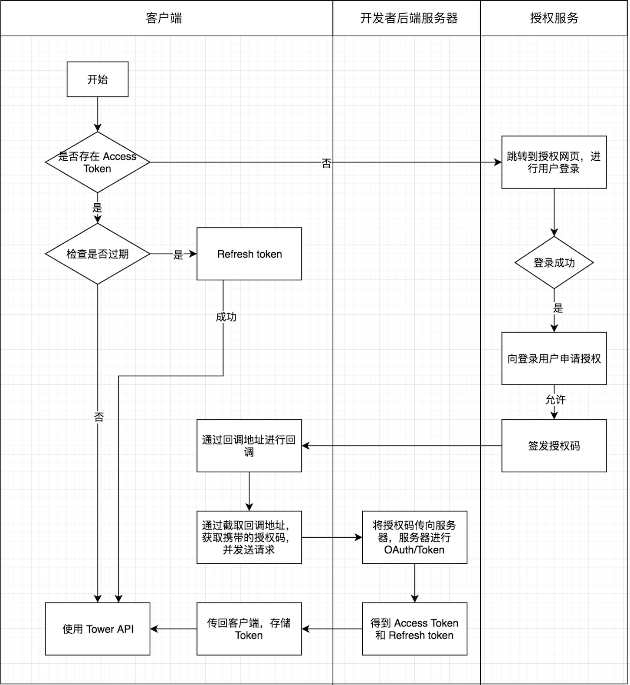

<center></center>
<br>


# 文档说明

Tower API 是提供给 [Tower Pro](https://tower.im/pro) 用户的一项专属服务，您可以通过 API 在其他平台上创建、更改或删除相关信息，便于集成 [Tower](https://tower.im) 到您的系统中。

Tower API 文档部署在 [GitHub Page](https://github.com/mycolorway/tower-api-document) 上，对于文中出现的错误我们非常欢迎您进行反馈，您可以创建 issue 或 pull request 进行更正。

## 快速起步

- 创建 Tower API


1. 进入你的 Tower 团队，点击左上方团队名称。
2. 选择**应用中心**，可以看到 **Tower API**。
3. 选择创建新应用。
4. 输入名称和回调地址，Scopes 可以留空。
5. 创建成功后，可以看到多出来的**应用 ID**和**私钥**，他们就是后面提到的 `client_id` 和 `client_sercet`。

> 回调地址测试时可以使用 `urn:ietf:wg:oauth:2.0:oob`，开发者应该设置自己的回调地址，例如 `https://www.example.com/oauth2/callback`，稍后可以看到回调地址的具体作用。


- 尝试第一次授权

> 推荐使用 [Postman](https://www.getpostman.com/apps) 进行尝试

1. 自动授权

准备工作：

- 需要将 `https://www.getpostman.com/oauth2/callback` 添加到创建应用时候的回调地址中。

开始配置：




在填写完 `Client ID` 和 `Client Secret` 及其他相关信息后，点击 `Request Token` 按照提示流程，就可以完成整个授权流程。


- 发送第一个请求

> 通过前面的步骤拿到了 Access Token


## OAuth 示例

### 生成 Access Token

- 客户端：


1. 当用户点击登录时候，弹出浏览器窗口访问 
```
https://tower.im/oauth/authorize?client_id={client_id}&redirect_uri=urn:ietf:wg:oauth:2.0:oob&response_type=code
```
>注意，在这里没有替换 redirect_uri，开发者在使用中一定要记得替换。

2. 授权完成后，会调用回调地址，此时需要截取浏览器中的重定向，获取回调携带的授权码。
>例如你的回调地址是`https://www.example.com/oauth2/callback`，在授权成功后会调用`https://www.example.com/oauth2/callback?code=authorizationcode`

3. 拿到授权码后

```
POST https://tower.im/oauth/token
```

参数

名称|类型|描述|
--|--|--|
`client_id`|`string`| 应用 ID
`client_secret`|`string`| 私钥
`code`|`string`| 客户端传来的 `Authorization Code`
`grant_type`|`string`| 此处填写为 `authorization_code`
`redirect_uri`|`string`| 一定要和之前填写的回调地址相同

4. 使用 Tower API 🎉。


### 刷新 Access Token

每一个 Token 默认在 2 小时后到期，此时需要用户进行刷新，同时您也需要注意 API 返回的 `expires_in` 数据，确保代码对过期时间改变后能够自动做出应对。

```
POST https://tower.im/oauth/token
```

Headers

名称|类型|描述|
--|--|--|
`Authorization`|`string`| 此处应该填写为 Bearer + access token，例如：`Bearer d4e949df783404f22e882430158f3b0440b608709d833f9b981e9a96b850f05c`


Parameters

名称|类型|描述|
--|--|--|
`refresh_token`|`string`| refresh token
`grant_type`|`string`| 此处应该填写为`refresh_token`

```json
Status: 200 OK

{
    "access_token": "d4e949df783404f22e882430158f3b0440b608709d833f9b981e9a96b850f05c",
    "token_type": "bearer",
    "expires_in": 7199,
    "refresh_token": "c426d5ab6a211310df088c77b36b38592f6752d5238f291b79174d93f7dc2ed5",
    "created_at": 1523420694,
    "email": "tower@tower.im"
}
```


## 开发

Tower API 的网址为:

```
https://tower.im/api/v1
``` 

API 使用 OAuth2.0 进行认证，`Access Token` 是全局唯一接口调用凭据，开发者调用各接口时都需使用 `Access Token`，请妥善保存。`Access Token` 的有效期目前为2个小时，需定时刷新，重复获取将导致上次获取的 `Access Token` 失效。

您在获取后，将 `Access Token` 添加到 API 的 Headers 中，从而确保能够获得正确的数据。

更多关于 OAuth2.0 的信息可以在[这里](http://www.ruanyifeng.com/blog/2014/05/oauth_2_0.html)查看和了解。


## API 示例

获取当前用户在团队中的信息

```
GET https://tower.im/api/v1/teams/{team_id}/member
```

Headers

名称|类型|描述|
--|--|--|
`Authorization`|`string`| 此处应该填写为`Bearer access_token`


## 安全性推荐

部署用于 OAuth Token 的服务器（*推荐*）。

> 服务器不是必须的，但我们极力推荐开发者将**私钥**部署在服务器上，避免客户端代码中携带**私钥**而造成安全隐患。


### 流程


